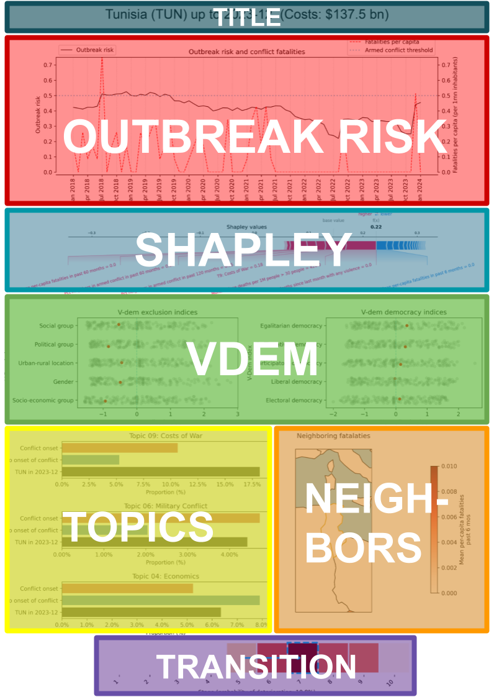

# Country-Risk-Report-Cards

A report card sumarizing the most relevant variables in a conflict forecast prediction project for the FCDO. The central problem is to predict which historically peaceful countries are at risk of conflict outbreak in the next 36 months. We use a variety of data sources and ML methods to generate our list. Some reports cards of countries on this list are included in this repository.

## How to read the country risk profile report card

### Title

We show the country name as well as the projected costs of the current conflict compared to the country in risk stage 1.

### Outbreak risk

The outbreak risk plot shows the value of two variables over time. Namely, the level of risk that conflict will occur in the next 36 months (black solid line - right vertical axis) and the number of fatalities per 1 million inhabitants (red dashed line - left vertical axis). The blue dotted line serves as a reference for the level of fatalities per capita we use to categorize whether a country is in a period of armed conflict. This graph is to meant to show how past fatalities influence the level of outbreak risk. 

### Shapley

The Shapley plot shows the predictors with the largest Shapely values in our prediction. Shapley values are a way to define the amount and direction a predictor influences the prediction. In short, it is the marginal effect of a predictor for the difference between the actual prediction and the mean prediction. 

### V-Dem

The V-Dem plot shows the normalized value of the specified V-Dem indices for each country, where the country associated with the dashboard is denoted in red. The V-Dem indices can take varied ranges, therefore we normalized each one to a standard normal distribution. Meaning the mean value, indicated by the blue dashed line, is 0 and the dots indicate how many standard deviations a country is away from the mean value. For further interpretation, due to the nature of the indices, it is ideal if the red dot is to the left of the blue dotted line for the V-Dem exclusion indices and to the right of the dotted line for the V-Dem democracy indices. 

### Topics

The Topics plot shows the average share of the specified topic in countries with a predicted onset of conflict in the next 36 months (red bar), in countries with no predicted onset of conflict in the next 36 months (blue bar), and the share of the specified topic for the country associated with the dashboard in the month of January 2024 (black bar). This plot is meant to show how present topics commonly associated with concepts related to armed conflict are in the media landscape of the country associated with the dashboard. 

### Neighbors

The Neighbor plot is a localized map that shows the mean amount of per-capita fatalities in the past 6 months for the country associated with the dashboard and its neighbors. The darker the shade of red the countries are, the higher the mean per-capita fatalities. This plot is meant to show the influence of neighboring conflict on the possibility of armed conflict in the country associated with the dashboard. 

### Transition

The Transition plot shows the current conflict stage the country associated dashboard is in and the most likely stage it will transition to in the next 3 months. Stages run from 1, indicating countries at extremely low risk of conflict outbreak, and stage 10, consisting countries already in conflict and stuck in the "conflict trap." The current conflict stage is denoted by the blue dashed box. The blue arrow shows the stage of the country for the previous month, and is shown only if this stage is different from the current stage.

